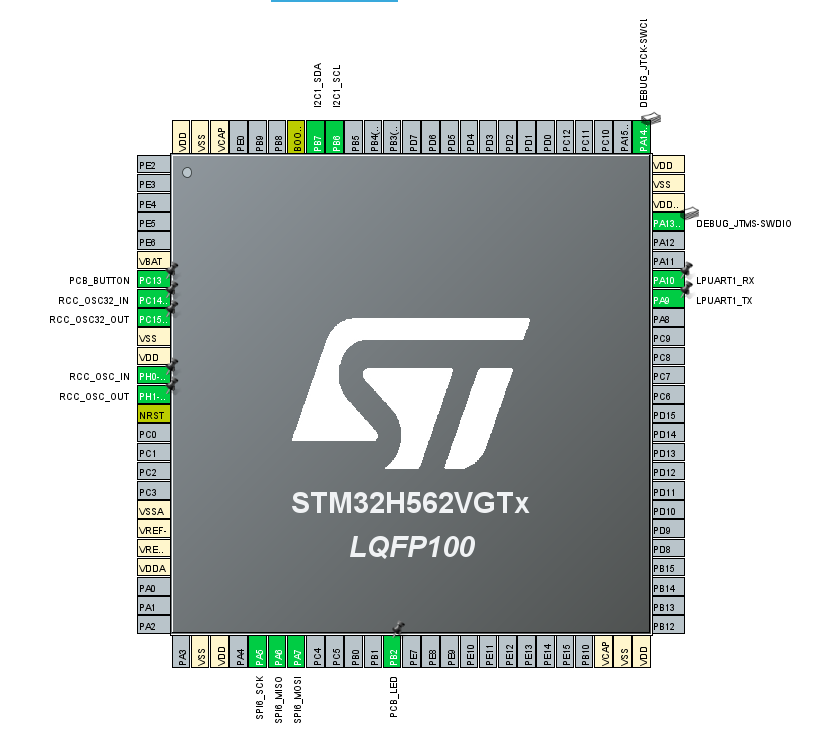

# STM32H562VGT6 評価F/W開発

## 開発環境

- マイコン: `STM32H562VGT6`
  - CPU: ARM Cortex-M33
  - FPU: 単精度FPU
  - Clock: 250MHz
  - Flash: 1MB
  - SRAM: 計 644KB
    - SRAM(1~3): 640KB
    - BKPSRAM(バックアップ用): 4KB
- OS
  - FreeRTOS (CMSIS RTOS 2)
- コンパイラ: Clang (`st-arm-clang 19.1.6`) 
  - 最適化: debug
- ツールチェイン
  - CMake
  - STM32CubeMX
  - STM32CubeIDE (VSCode版)
- デバッグ
  - デバッガ: `ST-LINK/V2-1`
    - デバッグI/F: SWD
  - printf()デバッグ
    - LPUART
      - TX: PA9ピン
      - RX: PA10ピン
      - 921600bps 8N1

## メモリ使用量

```shell
[build] Memory region         Used Size  Region Size  %age Used
[build]              RAM:       13968 B       640 KB      2.13%
[build]            FLASH:       34412 B         1 MB      3.28%
[build]          BK_SRAM:           4 B         4 KB      0.10%
```

## ピンアサイン


